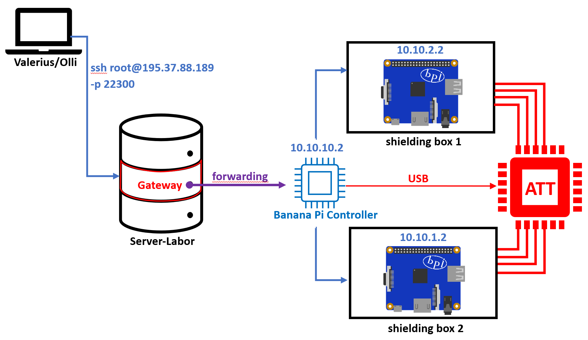

= Inhaltsverzeichnis

[[einleitung]]
== Einleitung
Das vorliegende Experiment befasst sich mit der Untersuchung der optimalen WLAN-Verbindung zwischen zwei BananaPi-Routern, die jeweils in einer Shielding Box platziert sind. Die beiden Router sind über einen gemeinsamen BananaPi-Controller verbunden, der wiederum über USB mit einem Attenuator, der als Dämpfungsglied fungiert, verbunden ist. Das Ziel des Experiments besteht darin, herauszufinden, welche Dämpfungen mit welchen Stärken und Mustern die schnellste Verbindung zwischen den beiden BananaPi-Routern ermöglichen. Durch die Variation der Dämpfungen sollen optimale Einstellungen ermittelt werden, um eine effiziente und zuverlässige WLAN-Kommunikation zwischen den beiden Geräten zu gewährleisten.....

[[aufbau]]
== Aufbau
Hier sehen sie den groben Aufbau des Projekts

Die einzelnen Banana Pi's haben folgende IP-Adressen:

[cols="1,1"]
|===
|Controller
|195.37.88.189 -p 22300

|BannanPi1
|192.168.2.2

|BannanPi2
|192.168.2.3
|=== 

=== BannanPi1 (Access Point): +
==== Schritt 1:
Bearbeiten der Konfigurationsdatei: _/etc/config/wireless_ +
unter _config wifi-device 'radio0'_ folgende Parameter ändern: 
|===
| option channel | 149
| option mode | VHT80
| option disabled | 0
|===
unter _wifi-iface 'default_radio0'_ Folgende Parameter ändern:
|===
|option network | wifi_1
|option mode | ap        
|option ssid | scux_shielding
|option encryption | psk2
|option key | Meshlab2021!
|===
mit _option disabled '1'_ das zweite Interface _wifi-device 'radio1'_ ausschalten

==== Schritt 2:
Bearbeiten der Konfigurationsdatei: _/etc/config/network_ +
hier legen ein neues Interface an: +
[listing]
----
config interface 'wifi_1' 
        option proto 'static'
        option netmask '255.255.255.0' 
        option ipaddr '10.10.10.1'
----

=== BannanPi2 (Station): +
==== Schritt 1:
Bearbeiten der Konfigurationsdatei: _/etc/config/wireless_ +
unter _config wifi-device 'radio0'_ folgende Parameter ändern: 
|===
| option channel | 149
| option mode | VHT80
| option disabled | 0
|===
unter _wifi-iface 'default_radio0'_ Folgende Parameter ändern:
|===
|option network | wifi_1
|option mode | sta        
|option ssid | scux_shielding
|option encryption | psk2
|option key | Meshlab2021!
|===
mit _option disabled '1'_ das zweite Interface _wifi-device 'radio1'_ ausschalten

==== Schritt 2:
Bearbeiten der Konfigurationsdatei: _/etc/config/network_ +
hier legen ein neues Interface an: +
[listing]
----
config interface 'wifi_1' 
        option proto 'static'
        option netmask '255.255.255.0' 
        option ipaddr '10.10.10.2'
----
=== Controller

=== Attenuator
Der Attenuator fungiert als Kontrollmechanismus, um gezielt den WLAN-Verkehr zu beeinflussen und verschiedene Szenarien zu simulieren. Durch die systematische Anpassung der Dämpfungseinstellungen können verschiedene Verbindungsszenarien getestet werden, um die Auswirkungen auf die Übertragungsgeschwindigkeit zu analysieren.

[[verwendung]]
== Verwendung
Das Ziel dieses Experiments besteht darin, die optimalen Dämpfungseinstellungen zu ermitteln, um die schnellstmögliche Verbindung zwischen den beiden BananaPi-Routern herzustellen. Dabei werden verschiedene Dämpfungen mit unterschiedlichen Stärken und Mustern getestet, um herauszufinden, welche Konfiguration die effizienteste und zuverlässigste WLAN-Kommunikation zwischen den Geräten ermöglicht. Durch die Variation der Dämpfungen werden die optimalen Einstellungen ermittelt, um eine optimale Übertragungsgeschwindigkeit und eine stabile Verbindung zwischen den BananaPi-Routern zu erreichen. Das Experiment trägt dazu bei, die WLAN-Performance zu maximieren und die bestmögliche Netzwerkleistung in diesem spezifischen Szenario zu erzielen.

Das Experiment bietet die Möglichkeit, wertvolle Erkenntnisse über die optimale Konfiguration der Dämpfungen zu gewinnen und eine Grundlage für die Optimierung der WLAN-Verbindung zwischen den beiden BananaPi-Routern in einer Shielding Box zu schaffen. Die Ergebnisse können zur Verbesserung der Netzwerkleistung und Stabilität in ähnlichen Umgebungen beitragen.
