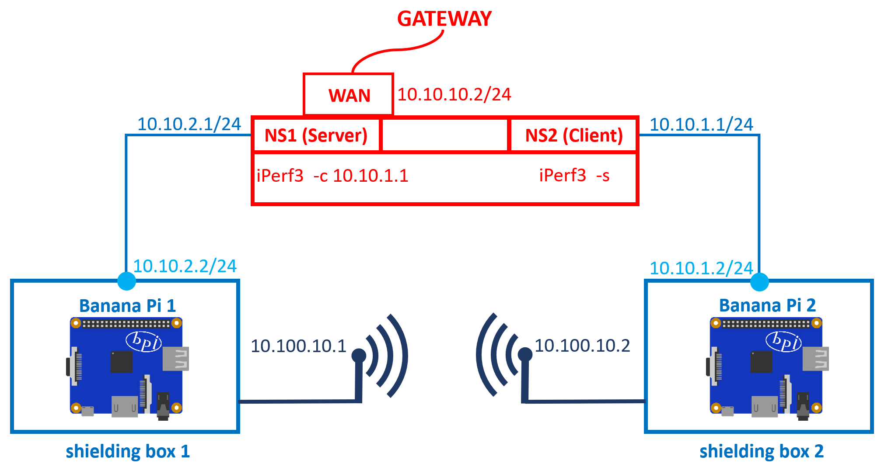

= Inhaltsverzeichnis

[[einleitung]]
== Einleitung
Das vorliegende Experiment befasst sich mit der Untersuchung der optimalen WLAN-Verbindung zwischen zwei BananaPi-Routern, die jeweils in einer Shielding Box platziert sind. Die beiden Router sind über einen gemeinsamen BananaPi-Controller verbunden, der wiederum über USB mit einem Attenuator, der als Dämpfungsglied fungiert, verbunden ist. Das Ziel des Experiments besteht darin, herauszufinden, welche Dämpfungen mit welchen Stärken und Mustern die schnellste Verbindung zwischen den beiden BananaPi-Routern ermöglichen. Durch die Variation der Dämpfungen sollen optimale Einstellungen ermittelt werden, um eine effiziente und zuverlässige WLAN-Kommunikation zwischen den beiden Geräten zu gewährleisten.

'''

[[aufbau]]
== Aufbau
Hier sehen sie den groben Aufbau des Projekts

image::Aufbau_Projekt.PNG[]

Die einzelnen Banana Pi's haben folgende IP-Adressen:

[cols="1,1"]
|===
|Controller
|10.10.10.2

|BananaPi1
|10.10.2.2

|BananaPi2
|10.10.1.2
|=== 

=== BananaPi1 (Access Point): +
==== Schritt 1:
Bearbeiten der Konfigurationsdatei: _/etc/config/wireless_ +
unter _config wifi-device 'radio0'_ folgende Parameter ändern: 
|===
| option channel | 149
| option mode | VHT80
| option disabled | 0
|===
unter _wifi-iface 'default_radio0'_ Folgende Parameter ändern:
|===
|option network | wifi_1
|option mode | ap        
|option ssid | scux_shielding
|option encryption | psk2
|option key | Meshlab2021!
|===
mit _option disabled '1'_ das zweite Interface _wifi-device 'radio1'_ ausschalten

==== Schritt 2:
Bearbeiten der Konfigurationsdatei: _/etc/config/network_ +
hier legen ein neues Interface an: +
[listing]
----
config interface 'wifi_1'
        option proto 'static'
        option netmask '255.255.255.0'
        option ipaddr '10.100.10.1
----

==== Schritt 3:
Zusätzlich haben wir noch eine Route in der _etc/config/network festgelgt_ um den Verkehr über die Wlan-Strecke zu leiten
----
config route 'use_wifi'
        option interface 'wifi_1'
        option target '10.10.1.0'
        option netmask '255.255.255.0'
        option gateway '10.100.10.2'
----

=== BananaPi2 (Station): +
==== Schritt 1:
Bearbeiten der Konfigurationsdatei: _/etc/config/wireless_ +
unter _config wifi-device 'radio0'_ folgende Parameter ändern: 
|===
| option channel | 149
| option mode | VHT80
| option disabled | 0
|===
unter _wifi-iface 'default_radio0'_ Folgende Parameter ändern:
|===
|option network | wifi_1
|option mode | sta        
|option ssid | scux_shielding
|option encryption | psk2
|option key | Meshlab2021!
|===
mit _option disabled '1'_ das zweite Interface _wifi-device 'radio1'_ ausschalten

==== Schritt 2:
Bearbeiten der Konfigurationsdatei: _/etc/config/network_ +
hier legen ein neues Interface an: +
[listing]
----
config interface 'wifi_1'
        option proto 'static'
        option netmask '255.255.255.0'
        option ipaddr '10.100.10.2'
----

==== Schritt 3:
Zusätzlich haben wir noch eine Route in der _etc/config/network_ festgelgt um den Verkehr über die Wlan-Strecke zu leiten
----
config route 'use_wifi'
        option interface 'wifi_1'
        option target '10.10.2.0'
        option netmask '255.255.255.0'
        option gateway '10.100.10.1'
----

=== Controller
Um die Verbindung mit iPerf3, mit hilfe von Namespaces, messen zu können müssen wir zunächst 2 Netzwerk-Interfaces anlegen. Diese sind nur für die Strecke zwischen dem Controller und dem Pi1 bzw. Pi2 zuständig. +
Die beiden Interfaces legen wir in der _etc/config/network_ des Controllers an:
----
config interface 'pi1'
        option device 'eth1'
        option proto 'static'
        option ipaddr '10.10.2.1/24'

config interface 'pi2'
        option device 'eth0'
        option proto 'static'
        option ipaddr '10.10.1.1/24'

config interface 'attenuator'
        option device 'eth3'
        option proto 'static'
        option ipaddr '172.20.10.1/24'

----
'''
=== Namespaces 
Da wir den Wlan-Verkehr zwischen den beiden BananaPi's mit verschiedenen Dämpfungswerten messen möchten, führen wir die Messungen in sogenannten Namespaces aus da der Controller somit sowohl als iPerf3 Server als auch als Client verwendet werden kann. Da wir später noch die Dämpfungen über den mit dem Controller ansteuerbaren Attenuator ändern wollen, ist dies eine gute Möglichkeit. 

==== Schritt 1: Namespaces anlegen:
Als erstes legen wir den Namespaces für den Server (BananaPi1) fest:
----
ip netns add server
ip link add ul-server link eth0 type macvlan mode bridge
ip link set dev ul-server netns server
ip netns exec server ip l set ul-server up
----

Jetzt legen wir noch einen zweiten Namespace für den Client (BananaPi2) an:
----
ip netns add client
ip link add ul-client link eth1 type macvlan mode bridge
ip link set dev ul-client netns client
ip netns exec client ip l set ul-client up
----

Wenn beide Namespaces eingerichtet sind, weisen wir den Interfaces ul-server und ul-client noch IP-Adressen zu.
----
ip netns exec server ip a add 10.10.1.3/24 dev ul-server
ip netns exec client ip a add 10.10.2.3/24 dev ul-client 
----

zusätlich zu den IP-Adressen müssen auch noch Routen für die Umleitung des Datenverkehrs für die Namespaces eingerichtet werden. Dies machen wir über folgende Befehle:
----
ip netns exec server ip r add 10.10.2.0/24 via 10.10.1.2
ip netns exec client ip r add 10.10.1.0/24 via 10.10.2.2
----

Um das ganze zu testen und sicher zu gehen das die Einrichtung fehlerfrei ist verwenden wir iPerf3.
Wir starten 2 Kommandozeilen und verbinden uns mit beiden auf dem Controller.
In einem der beiden Fenster starten wir einen iPerf3 Server und in dem anderen den Client.
----
ip netns exec server iperf3 -s
ip netns exec client iperf3 -c 10.10.1.3 -t 20
----
'''
=== Attenuator
Der Attenuator fungiert als Kontrollmechanismus, um gezielt den WLAN-Verkehr zu beeinflussen und verschiedene Szenarien zu simulieren. Durch die systematische Anpassung der Dämpfungseinstellungen können verschiedene Verbindungsszenarien getestet werden, um die Auswirkungen auf die Übertragungsgeschwindigkeit zu analysieren.
Um die Experimente auf dem Attenuator laufen zu lassen, haben wir ein https://github.com/thuehn/attenuator_script_python[Script] welches von Philipp Buechler geschrieben wurde verwendet. 
Im Script haben wir ein paar kleine Änderungen vorgenommen, sodass der Attenuator über Ethernet ansprechbar ist: 
----
def open_socket():
    try:
        global client_socket
        client_socket = socket.socket(socket.AF_INET, socket.SOCK_STREAM)
        client_socket.connect(('172.20.10.10', 23))
        print('create socket')
        return True
    except ConnectionError:
        print("Could not connect to the Attenuator. Check the IP address and port.")
        return False
----
'''
=== Versuchsvorbereitung
Bevor der Versuch gestartet werden kann muss die Zeit und die Dämpfung für jeden Chain in der tables.csv hinterlegt werden.
----
- Zeit;Dämpfung;Dämpfung;Dämpfung;Dämpfung
- am Ende "STOP" schreiben
Beispiel:
1000;30;30;30;30
STOP
----

'''

=== Versuch starten
Mit folgendem Befehl lässt sich der Versuch starten, das https://github.com/AssiKalle/Kommunikationssysteme_SS23/blob/main/start_test.sh[Script] befindet sich im Verzeichniss _etc/mnt/experiments/oli_valerius/_
----
sh start_test.sh 
----
sobald das Script gestartet ist, hat man die Möglichkeit zwischen Median/Mittelwert und Solotest zu wählen.
Dabei wird die Gesamtzeit des Versuchs aus der https://github.com/AssiKalle/Kommunikationssysteme_SS23/blob/main/tables.csv[tables.csv] berechnet. Die Zeit ist relevant für die Länge des Versuchs. Im Anschluss wird der iPerf3 Server, parallel dazu wird das Attenuator-Script gestartet und dazu verbindet sich der iPerf3 Client.
----
(1) - Mittelwert/Median
(2) - Solotest
----
Hat man den Versuch für Median/Mittelwert durchgeführt, befinden sich die iPerf_resulte _etc/mnt/experiments/oli_valerius/mittelwert_median/data/_ .
Bei dem Versuch für den Solotest befinden sich die Testergebnisse im Verzeichnis _etc/mnt/experiments/oli_valerius/solotest/_ .

'''
=== Aufbereiten der Daten 
Um den Median und den Mittelwert zu bestimmen müssen die Daten noch aufbereitet werden. Dies wird über folgenden Befehl möglich gemacht.
----
sh calc_median_mittelwert.sh
----
Nachdem dieses Script vollständig durchgelaufen ist befinden sich die Ergbnisse des Medians und Mittelwerts im Verzeichnis _etc/mnt/experiments/oli_valerius/mittelwert_median/_

=== Visualisierung der Testergebnisse 
Nachdem die Testergebnisse nun fertig aufbereitet sind, können diese als Plots dargestellt werden. Mithilfe des folgenden Befehls lassen sich die Plots für die jeweiligen Test erzeugen.
----
sh plotten.sh
(1) - Mittelwert
(2) - Median
(3) - Solotest
----
Die Plots von Mittelwert und Median befinden sich in dem Verzeichnis _etc/mnt/experiments/oli_valerius/mittelwert_median/_ . +
Der Plot für den Solotest ist in folgendem Verzeichnis zu finden _etc/mnt/experiments/oli_valerius/solotest/_ .

'''

[[verwendung]]
== Verwendung
Das Ziel dieses Experiments besteht darin, die optimalen Dämpfungseinstellungen zu ermitteln, um die schnellstmögliche Verbindung zwischen den beiden BananaPi-Routern herzustellen. Dabei werden verschiedene Dämpfungen mit unterschiedlichen Stärken und Mustern getestet, um herauszufinden, welche Konfiguration die effizienteste und zuverlässigste WLAN-Kommunikation zwischen den Geräten ermöglicht. Durch die Variation der Dämpfungen werden die optimalen Einstellungen ermittelt, um eine optimale Übertragungsgeschwindigkeit und eine stabile Verbindung zwischen den BananaPi-Routern zu erreichen. Das Experiment trägt dazu bei, die WLAN-Performance zu maximieren und die bestmögliche Netzwerkleistung in diesem spezifischen Szenario zu erzielen.

Das Experiment bietet die Möglichkeit, wertvolle Erkenntnisse über die optimale Konfiguration der Dämpfungen zu gewinnen und eine Grundlage für die Optimierung der WLAN-Verbindung zwischen den beiden BananaPi-Routern in einer Shielding Box zu schaffen. Die Ergebnisse können zur Verbesserung der Netzwerkleistung und Stabilität in ähnlichen Umgebungen beitragen.
